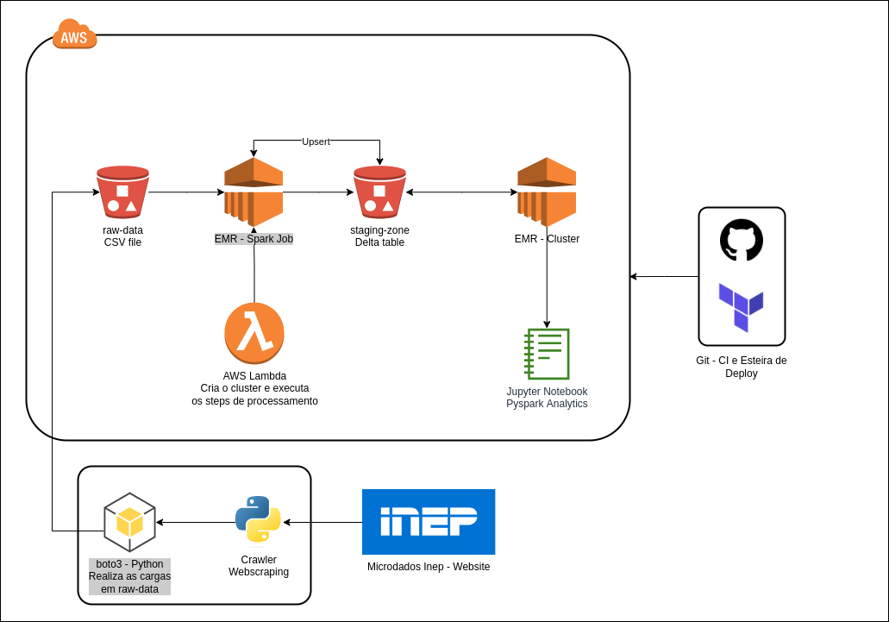

# Projeto Data Lakehouse

> Projeto de Criacao de um Data Lakehouse utilizando a nuvem `AWS`

Os dados sao extraidos por um crawler executado externamente e construido na linguagem `Python`.

O crawler sera responsavel por realizar um processo de raspagem de dados no site do INEP e realizar o download dos microdados do enem 2019. 

Os dados sao enviados para um bucket na `AWS S3` e depositados em uma camada raw.

Todo o pipeline de dados sera construido utilizando o `Terraform` e executado pelas esteiras de deploy do `GitHub`.

Uma funcao `Lambda` sera responsavel por subir um cluster no `AWS EMR` com dois steps `Spark`. O primeiro deles sera responsavel por realizar a transformacao dos dados da camada raw em tabelas delta depositadas em uma segunda camada de staging.

O segundo step spark realiza uma simulacao de update de dados na camada staging.

Por fim, os dados sao acessados por um notebook conectado ao cluster `EMR`.

## Arquitetura do Projeto



## Stack Tecnologica
[Python](https://www.python.org/)  
[AWS EMR](https://aws.amazon.com/pt/emr/)  
[AWS Lambda](https://aws.amazon.com/pt/lambda/)  
[AWS S3](https://aws.amazon.com/pt/s3/)  
[Terraform](https://www.terraform.io/)  
[Github Actions](https://github.com/features/actions)  

## Execucao do Crawler
Requisitos necessários para a instalação do sistema:
- [Python 3.10.2](https://www.python.org/downloads/)

Instale as dependências:

```terminal
    pip install -r requirements.txt
```

Preencha as lacunas do arquivo `config.yml.example` localizado na raiz do projeto o depois renomeie o arquivo para `config.yml`.  

Com o arquivo de configuracoes devidamente preenchido, execute o projeto.  

```terminal
    python run.py --config config.yml
```

## Criação do _Virtual Enviroment_ (opcional)
O _virtual enviroment_ Python é uma forma de encapsular as bibliotecas e recursos da sua aplicação, separando-os das demais aplicações Python no servidor e servindo na organização. A criação do ambiente virtual é opcional mas altamente recomendada.

O primeiro passo é instalar os pacotes abaixo:
> pip install virtualenv virtualenvwrapper


Para que o `virtualenvwrapper` possa ser utilizado é necessário adicioná-lo como _source_. Para isso, o comando abaixo deve ser adicionado ao fim do seu arquivo `~/.bashrc`. Salve o arquivo e reinicie o terminal.
